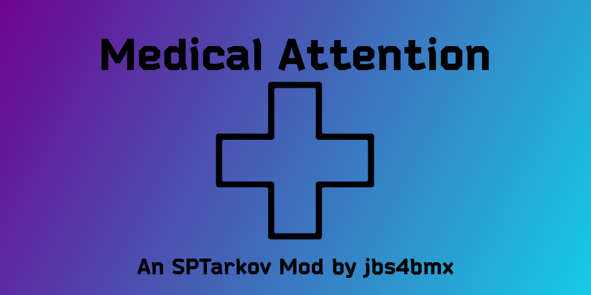

<a id="readme-top"></a>
[![Contributors][contributors-shield]][contributors-url]
[![Forks][forks-shield]][forks-url]
[![Stargazers][stars-shield]][stars-url]
[![Issues][issues-shield]][issues-url]
[![MIT License][license-shield]][license-url]

<!-- PROJECT LOGO -->
<br />
<div align="center">
  <a href="https://github.com/jbs4bmx/MedicalAttention">
    
  </a>

  <h3 align="center">Medical Attention</h3>

  <p align="center">Modification of pain killers, med kits, surgical kits, splints, bandages, balms, and injectors.<br /></p>

  [](https://ko-fi.com/X8X611JH15)
</div>


<!-- TABLE OF CONTENTS -->
<details>
  <summary>Table of Contents</summary>
  <ol>
    <li>
      <a href="#about-the-project">About The Project</a>
      <ul>
        <li><a href="#built-with">Built With</a></li>
      </ul>
    </li>
    <li>
      <a href="#getting-started">Getting Started</a>
      <ul>
        <li><a href="#prerequisites">Prerequisites</a></li>
        <li><a href="#installation">Installation</a></li>
      </ul>
    </li>
    <li>
      <a href="#configuration">Configuration</a>
      <ul>
        <li><a href="#mod-faq">Mod FAQ</a></li>
      </ul>
    </li>
    <li><a href="#roadmap">Roadmap</a></li>
    <li><a href="#contributing">Contributing</a></li>
    <li><a href="#license">License</a></li>
    <li><a href="#acknowledgments">Acknowledgments</a></li>
  </ol>
</details>


<!-- ABOUT THE PROJECT -->
## About The Project
Type: Server Mod</br>
Disclaimer: **This mod is provided _as-is_ with _no guarantee_ of support.**

Fully enhanced medical supplies to aid in your neverending quest to escape from the region known as Tarkov. This mod increases HP of medical items, the duration of positive health effects, and adds additional healing properties to some medical items.

All med kits have the option to be configured to enable a "Heal over time" function. This takes precedence over the typical healing function and instead enables your PMC or Player SCAV to heal over time while playing the game. This feature can be used for long term healing, but you can also still use any med kits for standard healing that do not have the feature enabled.</br></br>

**List of items that currently are able to, or can be configured to, repair a blacked out body part.**</br>
_Table updated for version 380.0.2 and newer._
| Item                     | Potential HP Loss (percent) |
|:-------------------------|:----------------------------|
| Salewa                   | Up to max of 30 %           |
| IFAK                     | Up to max of 20 %           |
| Sanitar's IFAK           | Guaranteed loss of 25-75%   |
| AFAK                     | 0 %                         |
| Grizzly                  | 0 %                         |
| CMS                      | Up to max of 10 %           |
| Sanitar's CMS            | Guaranteed loss of 10-70%   |
| Surv12 Field Surgery Kit | 0 %                         |
</br></br>

**Notice**</br>
There is one caveat to using this mod after enabling "fix fractures" and/or "fix destroyed parts" on Salewa, IFAK, AFAK, Sanitar's IFAK, or Grizzly medkits...
  * When healing fractures or destroyed parts with enhanced med kits, your character cannot move.
    * It is a side-effect of adding the "surgical kit"-like feature to med kits.
    * Take cover to heal if you have this feature enabled!
<br><br>

<p align="right">(<a href="#readme-top">back to top</a>)</p>


### Built With
| Frameworks/Libraries                                      | Name         | Link                                       |
| :-------------------------------------------------------: | :----------: | :----------------------------------------: |
|       | `TypeScript` | [TypeScript Website][TypeScript-url]       |

|                         IDEs                                |      Name       | Link                                      |
| :---------------------------------------------------------: | :-------------: | :---------------------------------------: |
|      | `VSCodium`      | [VSCodium Website][Vscodium-url]          |

<p align="right">(<a href="#readme-top">back to top</a>)</p>


<!-- GETTING STARTED -->
## Getting Started
This section will explain how to install and use this mod.

### Prerequisites
EFT and SPT are required to use this mod.

### Installation
_For the purpose of these directions, "[SPT]" represents your SPT folder path._

Start by downloading the mod from the [Releases](https://github.com/jbs4bmx/MedicalAttention/releases) page.

Follow these steps to install and configure the mod:
  1. Extract the contents of the zip file into the root of your [SPT] folder.
     - That's the same location as "SPT.Server.exe" and "SPT.Launcher.exe".
  2. Edit the Config to adjust the values to your liking.
  3. Start SPT.Server.exe and wait until it fully loads.
  4. Start SPT.Launcher.exe.
  5. Now you can launch the game and profit.

<p align="right">(<a href="#readme-top">back to top</a>)</p>


<!-- CONFIGURATION EXAMPLES -->
## Configuration
Medical Supplies are customizable by editing the included config.json file. The customizable options have been greatly increased to allow for more targeted amplification of medical items. You can enable modification on one or more items and further modify those items affects to your liking.</br>
```jsonc
{
    "MedKits":{
        "Ai2": {
            // Soviet AI-2 Medkit
            "Enable": true,
            "hpResource": 250,
            "hpResourceRate": 20,
            "Duration": 180,
            "AddStopLightBleeding": true,
            "AddStopHeavyBleeding": true,
            "HealOverTime": false,
            "HealOverTimeDuration": 120
        },
        "Car": {
            // Swiss Safe 2-in-1 First Aid Kit (Car Medkit)
            "Enable": true,
            "hpResource": 500,
            "hpResourceRate": 40,
            "Duration": 180,
            "AddStopHeavyBleeding": true,
            "HealOverTime": false,
            "HealOverTimeDuration": 120
        },
        "Salewa": {
            // SALEWA - First Aid Kit Waterproof
            "Enable": true,
            "hpResource": 1000,
            "hpResourceRate": 50,
            "Duration": 180,
            "AddFixFracture": true,
            "AddFixDestroyedPart": true,
            "HealOverTime": false,
            "HealOverTimeDuration": 120
        },
        "Ifak": {
            // Individual First Aid Kit (IFAK)
            "Enable": true,
            "hpResource": 1000,
            "hpResourceRate": 100,
            "Duration": 180,
            "AddFixFracture": true,
            "AddFixDestroyedPart": true,
            "HealOverTime": false,
            "HealOverTimeDuration": 120
        },
        "Sanitar": {
            // Sanitar's AFAK
            "Enable": true,
            "ResizeTo1x1": true,
            "hpResource": 2000,
            "hpResourceRate": 5,
            "Duration": 15,
            "AddStopLightBleeding": true,
            "AddStopHeavyBleeding": true,
            "AddFixFracture": true,
            "HealOverTime": false,
            "HealOverTimeDuration": 120
        },
        "Afak": {
            // Advanced Individual First Aid Kit (AFAK)
            "Enable": true,
            "hpResource": 1500,
            "hpResourceRate": 100,
            "Duration": 180,
            "AddFixFracture": true,
            "AddFixDestroyedPart": true,
            "HealOverTime": false,
            "HealOverTimeDuration": 120
        },
        "Grizzly": {
            // Sportsman Series Grizzly Medical Kit
            "Enable": true,
            "hpResource": 5000,
            "hpResourceRate": 125,
            "Duration": 180,
            "AddFixDestroyedPart": true,
            "HealOverTime": false,
            "HealOverTimeDuration": 120
        }
    },
    "Pills": {
        "Analgin": {
            // Analgin (Actually illegal to purchase in real life!)
            "Enable": true,
            "hpResource": 24,
            "Duration": 360,
            "AddEnergyIncrease": true,
            "EnergyIncrease": 15,
            "HydrationBurn": -2,
            "AddRadExposureFix": true
        },
        "Augmentin": {
            // Augmentin Anti-Biotics
            "Enable": true,
            "hpResource": 45,
            "Duration": 360,
            "EnergyIncrease": 15,
            "HydrationBurn": -2,
            "AddRadExposureFix": true
        },
        "Ibuprofen": {
            // Ibuprofen
            "Enable": true,
            "hpResource": 90,
            "Duration": 360,
            "AddEnergyIncrease": true,
            "EnergyIncrease": 15,
            "HydrationBurn": -2,
            "AddRadExposureFix": true
        }
    },
    "Bandages": {
        "Aseptic": {
            // Medpride Conforming Stretch Gauze
            "Enable": true,
            "hpResource": 8,
            "AddStopHeavyBleeding": true
        },
        "Army": {
            // Russian Individual dressing bag PPI AB-3
            "Enable": true,
            "hpResource": 4,
            "AddStopHeavyBleeding": true
        }
    },
    "Splints": {
        "Splint": {
            // EVERLIT Survival 36 Inch Splint
            "Enable": true,
            "hpResource": 8
        },
        "AluminumSplint": {
            // Archer Medtech Universal First Aid Splint - Moldable Aluminum
            "Enable": true,
            "hpResource": 8
        }
    },
    "Topicals": {
        "Vaseline": {
            // Norka Vaseline cosmetic "Mink"
            "Enable": true,
            "hpResource": 10,
            "Duration": 360,
            "EnergyBurn": -2,
            "HydrationBurn": -2,
            "AddRadExposureFix": true
        },
        "GoldenStarBalm": {
            // Golden Star Balm
            "Enable": true,
            "hpResource": 10,
            "Duration": 360,
            "EnergyBurn": -2,
            "EnableHydrationBurn": true,
            "HydrationBurn": -2,
            "AddRadExposureFix": true
        }
    },
    "SurgicalKits": {
        "CMSSurgicalKit": {
            // Tactical Surgical and Suture Kit
            "Enable": true,
            "hpResource": 10,
            "AddStopLightBleeding": true,
            "AddStopHeavyBleeding": true,
            "AddFixFracture": true
        },
        "SanitarSurgicalKit": {
            // Also based on the Tactical Surgical and Suture Kit
            "Enable": true,
            "ResizeTo2x1": true,
            "hpResource": 8,
            "AddStopLightBleeding": true,
            "AddStopHeavyBleeding": true,
            "AddFixFracture": true
        },
        "Surv12FieldSurgicalKit": {
            // 12 Survivors First Aid Rollup Kit
            "Enable": true,
            "hpResource": 12,
            "AddStopLightBleeding": true,
            "AddStopHeavyBleeding": true
        }
    },
    "Tourniquets": {
        "Esmarch": {
            // Blood Loss Arterial Bleeding Rubber Band (aka Soviet Pink Tourniquet Esmarch)
            "Enable": true,
            "hpResource": 5,
            "AddStopLightBleeding": true
        },
        "CalokB": {
            // Celox V12090 Blood Clotting Granule Applicator and Plunger
            "Enable": true,
            "hpResource": 5,
            "AddStopLightBleeding": true
        },
        "Cat": {
            // North American Rescue NAR CAT Tourniquet
            "Enable": true,
            "hpResource": 5,
            "AddStopLightBleeding": true
        }
    },
    "Injectors": {
        "All": {
            // This setting is a WIP. It has not yet been tested.
            "AllInjectorsSpawnEverywhere": false
        },
        "Morphine": {
            // Morphine Injector
            "Enable": true,
            "hpResource": 4,
            "Duration": 360,
            "HydrationBurn": -2,
            "EnergyBurn": -2
        },
        "Sj1": {
            // Combat Stimulant Injector SJ1 TGLabs
            "Enable": true,
            "hpResource": 4
        },
        "eTGchange": {
            // Regenerative Stimulant Injector eTG-change
            "Enable": true,
            "hpResource": 4,
            "Duration": 360
        },
        "Sj6": {
            // Combat Stimulant Injector SJ6 TGLabs
            "Enable": true,
            "hpResource": 4
        },
        "Sj9": {
            // Combat Stimulant Injector SJ9 TGLabs
            "Enable": true,
            "hpResource": 4
        },
        "Propital": {
            // Propital
            "Enable": true,
            "hpResource": 4,
            "Duration": 360
        },
        "Zagustin": {
            // Hemostatic Drug Zagustin
            "Enable": true,
            "hpResource": 4,
            "Duration": 360
        },
        "Adrenaline": {
            // Adrenaline Injector
            "Enable": true,
            "hpResource": 4,
            "Duration": 360
        },
        "Meldonin": {
            // Meldonin
            "Enable": true,
            "hpResource": 4
        },
        "Ahf1m": {
            // AHF1-M
            "Enable": true,
            "hpResource": 4
        },
        "bTG": {
            // 3-(b-TG)
            "Enable": true,
            "hpResource": 4
        },
        "Norepinephrine": {
            // L1 (Norepinephrine)
            "Enable": true,
            "hpResource": 4,
            "Duration": 360
        },
        "p22": {
            // P22
            "Enable": true,
            "hpResource": 4
        },
        "Obdolbos": {
            // Cocktail "Oldolbos"
            "Enable": true,
            "hpResource": 4
        },
        "Mule": {
            // M.U.L.E. stimulator
            "Enable": true,
            "hpResource": 4
        },
        "xTG12": {
            // Antidote xTG-12
            "Enable": true,
            "hpResource": 4
        },
        "Obdolbos2": {
            // Obdolbos 2
            "Enable": true,
            "hpResource": 4
        },
        "Sj12": {
            // SJ12 TGLabs
            "Enable": true,
            "hpResource": 4
        },
        "Perfotoran": {
            // Perfotoran (Blue Blood)
            "Enable": true,
            "hpResource": 4,
            "Duration": 360
        },
        "Trimadol": {
            // Trimadol
            "Enable": true,
            "hpResource": 4,
            "Duration": 360
        },
        "Pnb": {
            // PNB
            "Enable": true,
            "hpResource": 4,
            "Duration": 360
        },
        "a2bTG": {
            // 2A2-(b-TG)
            "Enable": true,
            "hpResource": 4
        },
        "Ebudal": {
            // Ebudal
            "Enable": true,
            "hpResource": 4,
            "Duration": 360
        },
        "ModInjectors": {
            // All custom injectors from mods.
            // This setting is a WIP. It has not yet been tested.
            "Enable": false,
            "hpResource": 4
        }
    }
}
```

<p align="right">(<a href="#readme-top">back to top</a>)</p>

### Mod FAQ
**Q: Where do I report bugs found with the current version of the mod?** <br>
A: You can report bugs for the current version of this mod on the [MA Mod Page](https://hub.sp-tarkov.com/files/file/255-medical-attention/).

<p align="right">(<a href="#readme-top">back to top</a>)</p>


<!-- ROADMAP -->
## Roadmap
- [X] Add Changelog
- [ ] Add function to CMS and Surv12 to heal blacked thorax/head.
- [X] Add Heal-Over-Time option to medkits.
- [ ] Update/balance values of topicals and pills.

Suggest changes or view/report issues [here](https://github.com/jbs4bmx/MedicalAttention/issues).

<p align="right">(<a href="#readme-top">back to top</a>)</p>


<!-- CONTRIBUTING -->
## Contributing
Contributions are what make the open source community such an amazing place to learn, inspire, and create. Any contributions you make are **greatly appreciated**.

If you have a suggestion that would make this better, please fork the repo and create a pull request. You can also simply open an issue with the tag "enhancement".
Don't forget to give the project a star! Thanks again!

1. Fork the Project
2. Create your Feature Branch (`git checkout -b feature/AmazingFeature`)
3. Commit your Changes (`git commit -m 'Add some AmazingFeature'`)
4. Push to the Branch (`git push origin feature/AmazingFeature`)
5. Open a Pull Request

You can also buy me a coffee! (This is not required, but I greatly appreciate any support provided.)</br>
[](https://ko-fi.com/X8X611JH15)

<p align="right">(<a href="#readme-top">back to top</a>)</p>


<!-- LICENSE -->
## License
Distributed under the MIT License. See `LICENSE.txt` for more information.

<p align="right">(<a href="#readme-top">back to top</a>)</p>


<!-- ACKNOWLEDGMENTS -->
## Acknowledgments
Contributors:
None yet.

<p align="right">(<a href="#readme-top">back to top</a>)</p>


<!-- Repository Metrics -->
[contributors-shield]: https://img.shields.io/github/contributors/jbs4bmx/MedicalAttention.svg?style=for-the-badge
[contributors-url]: https://github.com/jbs4bmx/MedicalAttention/graphs/contributors
[forks-shield]: https://img.shields.io/github/forks/jbs4bmx/MedicalAttention.svg?style=for-the-badge
[forks-url]: https://github.com/jbs4bmx/MedicalAttention/network/members
[stars-shield]: https://img.shields.io/github/stars/jbs4bmx/MedicalAttention.svg?style=for-the-badge
[stars-url]: https://github.com/jbs4bmx/MedicalAttention/stargazers
[issues-shield]: https://img.shields.io/github/issues/jbs4bmx/MedicalAttention.svg?style=for-the-badge
[issues-url]: https://github.com/jbs4bmx/MedicalAttention/issues
[license-shield]: https://img.shields.io/github/license/jbs4bmx/MedicalAttention.svg?style=for-the-badge
[license-url]: https://github.com/jbs4bmx/MedicalAttention/blob/master/LICENSE.txt


<!-- Framwork/Library URLs -->
[TypeScript-url]: https://www.typescriptlang.org/
[Vscodium-url]: https://vscodium.com/
